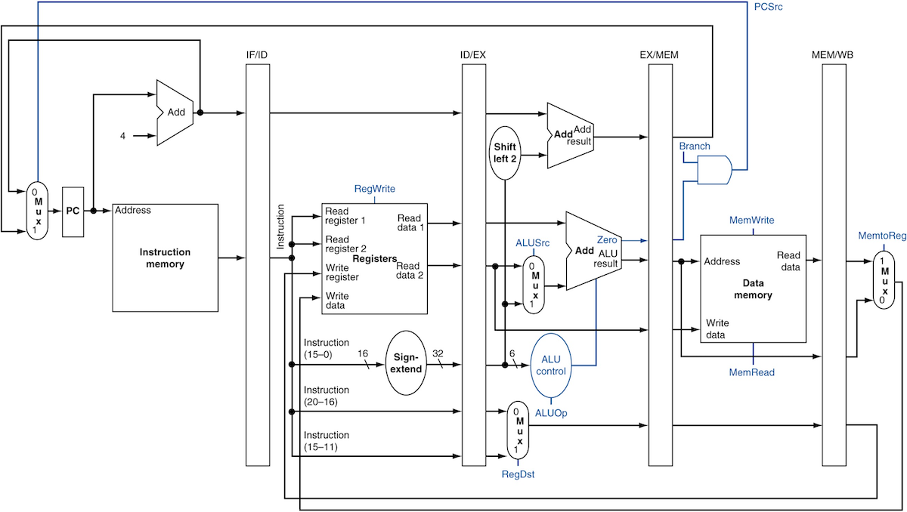

## Programming Assignment #3: MIPS Emulator with Pipelining

### ***Due on December 14 (Thursday), 24:00 ***

### Goal

Implemant an emulator of the pipelined MIPS architecture, illustrated in the figure:




### Problem Specification

- In PA2, you built the single-cycle MIPS emulator. In this PA, you will split the implementation into stages so that it supports the pipelined execution.

- Should support following instructions.

  | Name   | Format |Opcode / opcode + funct |
  | ------ | ------ | ---------------------- |
  | `add`  |   R    | 0 + 0x20               |
  | `addi` |   I    | 0x08                   |
  | `sub`  |   R    | 0 + 0x22               |
  | `and`  |   R    | 0 + 0x24               |
  | `andi` |   I    | 0x0c                   |
  | `or`   |   R    | 0 + 0x25               |
  | `ori`  |   I    | 0x0d                   |
  | `nor`  |   R    | 0 + 0x27               |
  | `sll`  |   R    | 0 + 0x00               |
  | `srl`  |   R    | 0 + 0x02               |
  | `sra`  |   R    | 0 + 0x03               |
  | `lw`   |   I    | 0x23                   |
  | `sw`   |   I    | 0x2b                   |
  | `beq`  |   I    | 0x04                   |
  | `bne`  |   I    | 0x05                   |
  | `slt`  |   R    | 0 + 0x2a               |
  | `slti` |   I    | 0x0a                   |
  | `jr`   |   R    | 0 + 0x08               |
  | `j`    |   J    | 0x02                   |
  | `jal`  |   J    | 0x03                   |
  | `noop` |   -    | 0x00000000             |

- Compared to PA2, the `halt` instruction is removed. Instead, there is a special instruction `noop`, which does nothing at all. Its machine instruction is `0x00000000`. The emulator framework stops execution when all stage are filled with the `noop` instruction.

- Unlike the previous PAs, this PA is comprised of multiple files. `main.c` contains the code for the framework and `pa3.c` is supposed to have the code for the implementation for pipeline stages. You can submit `pa3.c` only so any changes in `main.c` do not have any effect on your grading. In other words, you should implement everything in `pa3.c`.

- `__run_cycle()` in `main.c` is the entry for the pipelined execution. So it is worthy to analyze its execution.

- `struct stage` summarizes the status for each stage. As commented in `types.h`, you should not use `__pc` for your implementation other than that is already used in `IF_stage` in the handout.

- `struct IF_ID, ID_EX, EX_MEM, MEM_WB` are the pipeline registers. You may use them for your own sake, but you may get some hints from their names what value should be transferred between the stages.

- The framework supports almost the same commands to those of PA2; it supports the same `show` and `dump` command to PA2.

- `pipe` command is a newly added command that allows you to check the status of pipeline. It displays the instruction, memory addresses of the instruction, and remaining cycles to be stalled, for each stage.
 ```
 >> pipe

 ### 11 ###  <-- Emulator finished 11st cycle.
  IF: 0x00000000  0x00000000  2  <-- IF stage will be stalled for 2 cycles.
  ID: 0x08000400  0x00001014  0  <-- ID stage is processing `0x08000400` at `0x1014`.
  EX: 0x00000000  0x00000000  0  <-- EX stage is doing nothing for this cycle
 MEM: 0x00000000  0x00000000  0
  WB: 0x10130001  0x00001010  0
 ```

- `next` command allows you to step forward one cycle.

- You don't have to deal with data dependency, but should deal with the control hazard. Just implement each component in the figure in its corresponding stages.


### Hints and Comments

- Don't try to build the entire emulator at once.

- Implement data-path for simple r-type instructions such as `add` first, then implement more r-type instructions and simple i-type instructions. Leave the branch instructions to the last goal.

- Leave MEM stage simple until you implement `lw` and `sw`.

- To implement branch instructions, design how the emulator can deal with the hazards. Try to understand how `make_stall()` in `main.c` works.

- Check the orders of operands.


### Submission / Grading

- Total 500 pts

- Source: `pa3.c` (400 pts)
  - The fundamental pipeline (300 pts)
  - Dealing with control hazards properly (100 pts)

- Document: one PDF document (100 pts) including **all** the following topics;
  - Explain the full steps of your pipeline implementation.
  - How did you deal with the control hazard
  - Sketch your idea to implement the forwarding, in addition to your submission. Note this does not mean you should implement forwarding but just give some idea on that.
    - In case you did implement the forwarding, mention in the document and explain you implementation in detail. You will get two additional pages for explaining it.
  - Unlike previous PAs, the instructor will evaluate the *quality* of document in addition to contents. So, try to make your document *WELL-ORGANIZED* and *READABLE*.
    - Do not read your code; you cannot get a good grade with plain explanation.
    - *MUST EXPLAIN* how you reached to the idea of your implementation and mark it *CLEARLY REPRESENTED* in the document.
  - No more than 4 pages
